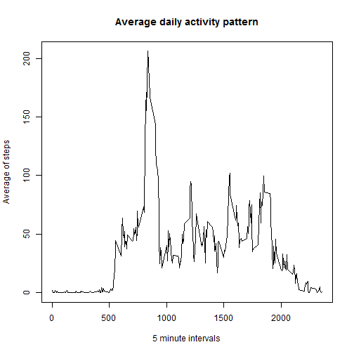

---
title: 'Reproducible Research: Peer Assessment 1'
output:
  pdf_document: default
  html_document:
    keep_md: yes
---  


        


## Loading and preprocessing the data  
<br>
Here we load the "activity.csv" file into an object named "data" :
<br>

```r
data <- read.csv("activity.csv")
```

## What is mean total number of steps taken per day?  
<br>
For each unique date that appeares in our data we compute the total sum of steps for that day. Sums are stored in a new data frame called data2.  
<br>
We use this information to plot a histogram of steps taken per day.
  


```r
data2 <- aggregate(data$steps ~ data$date, FUN = sum, na.action = na.pass)
colnames(data2) <- (c("dates", "steps"))
hist(data2$steps, col = "red", xlab = "Steps per day", main="Histogram of steps", breaks = 20) 
```

 

Mean and median of steps per day are also computed. 


```r
mean_na = round(mean(data2$steps, na.rm = TRUE), 2)
median_na = median(data2$steps, na.rm = TRUE)
```


Mean total number of steps per day (NAs are ignored) is: 10766.19   
Median total number of steps per day (NAs are ignored) is: 10765 


## What is the average daily activity pattern?  
<br>
For the average daily activity pattern we nce morewe calculate an aggregation of average of steps, this time by each interval.


```r
steps_mean <- aggregate(data$steps, by = list(interval = data$interval), FUN=mean, na.rm=TRUE)
colnames(steps_mean) <- c("interval", "mean")
```
The plot is produced by the following code:

```r
plot(steps_mean$interval, steps_mean$mean, type="n", main="Average daily activity pattern", ylab='Average of steps', xlab="5 minute intervals")
lines(steps_mean$interval, steps_mean$mean)
```

 
<br>
Let's find the interval, which contains the maximum number of steps on average:

```r
max_interval <- steps_mean$interval[which.max(steps_mean$mean)]
```
It is interval 835.

## Imputing missing values
<br>
The total number of rows containing missing values (NAs) is computed by the following code:


```r
incompletes <- sum(is.na(data$steps))
```
The total number of rows with missing values is 2304. 
<p>
To fill in for the missing values of number of steps, I would choose median of that interval, for two reasons: <br>
1. median will produce an integer value, as number of steps is expected to be <br>
2. activity varies during the day as seen on previous plot, therefore specific interval is a much better approximation than entire day
<p>
Let's now create another data frame (e.g. "data3") that will contain interval step averages instead of NAs:


```r
data3 <- data
steps_median <- aggregate(data$steps, by = list(interval = data$interval), FUN=median, na.rm=TRUE)
rep_median <- rep(steps_median$x, times=1, each = 61)

# I know this for loop is a funny solution, but I have not yet finished
# R programming course.

for(i in 1:nrow(data3)){
    if( is.na(data3$steps[i]) == TRUE)
      {
        data3$steps[i] <- rep_median[i]
      }
}
```

Now let's repeat the computation of median, mean and plot a new histogram, like we have already done, only this time with the new data frame:


```r
data2 <- aggregate(data3$steps ~ data3$date, FUN = sum, na.action = na.pass)
colnames(data2) <- (c("dates", "steps"))
hist(data2$steps, col = "blue", xlab = "Steps per day", main="Histogram of steps", breaks = 20) 
```

 

Mean and median of steps per day, without NAs:


```r
mean = round(mean(data2$steps, na.rm = TRUE), 2)
median = median(data2$steps, na.rm = TRUE)
```

Mean total number of steps per day is: 9402.84  
Median total number of steps per day is: 10395 
<p>
Values of computations, done with replaced NAs, do not differ drastically with these done with NAs ignored. However it is noticeable that the number of "zero-steps" increases a lot. This is because medians for many intervals were zeroes, and many of these zeroes came in place of NAs.

## Are there differences in activity patterns between weekdays and weekends?
<br>

To answer this question, we must read the information on dates and find their asociated days of the week. After that we separate these days into 2 groups - those belonging to weekend(Saturday and Sunday) and those belonging to midweek (all others). <br>
After that we proceed with computation of average number of steps, as we have done already before:


```r
Sys.setlocale("LC_ALL", "C")
dates <- as.Date(data3$date)

midweekANDweekend <- weekdays(dates)
midweekANDweekend <- ifelse(midweekANDweekend %in% c("Saturday", "Sunday"), "weekend", "midweek")
data3[,"midweekANDweekend"] <- as.factor(midweekANDweekend)

AveragedSteps <- aggregate(data3$steps, by = data3[, c("interval", "midweekANDweekend")],  mean)

library(lattice)
xyplot(x ~ interval | midweekANDweekend, 
       data = AveragedSteps, layout = c(1,2), type='l', ylab="Average number of steps", xlab="Interval")
```

 
<p>
From the plot we see that the average number of steps is more evenly spread across the intervals during weekend, as opposed to during midweek days. We could attribute this to the rather different schedules of most people (work/school in midweek and free days on weekend).
